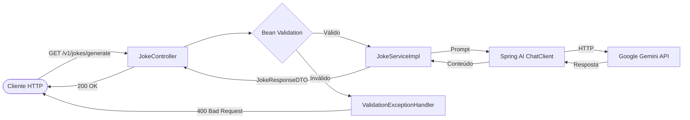

# Spring AI Jokes 🤖🃏

API REST que gera piadas utilizando inteligência artificial (Google Gemini) através do Spring AI.

## Overview

O projeto é uma aplicação Spring Boot que expõe um endpoint para geração de piadas personalizáveis. O usuário escolhe o **tema**, o **nível de humor** e a **quantidade de palavras**, e a IA gera uma piada sob medida.

### Tecnologias

- Java 21
- Spring Boot 3.5
- Spring AI 1.0.3 (com adaptador OpenAI apontando para Google Gemini)
- Bean Validation (Jakarta)
- SpringDoc OpenAPI (Swagger UI)
- Lombok
- JUnit 5 + Mockito

## Arquitetura



### Estrutura de pacotes

```
src/main/java/br/com/gabrielga_dev/spring_ai_jokes/
├── config/
│   ├── ChatClientConfig.java      # Bean do ChatClient
│   └── OpenApiConfig.java         # Configuração Swagger
├── controller/
│   ├── api/
│   │   └── JokeApi.java           # Interface com anotações OpenAPI
│   ├── handler/
│   │   └── ValidationExceptionHandler.java
│   └── JokeController.java
├── data_shape/
│   ├── dto/
│   │   ├── request/
│   │   │   └── JokeRequestDTO.java
│   │   └── response/
│   │       └── JokeResponseDTO.java
│   └── types/
│       ├── LevelType.java
│       └── ThemeType.java
└── service/
    ├── JokeService.java
    └── impl/
        └── JokeServiceImpl.java
```

## API

### `GET /v1/jokes/generate`

Gera uma piada com base nos parâmetros fornecidos.

#### Parâmetros (query string)

| Parâmetro   | Tipo   | Obrigatório | Descrição                          | Valores aceitos                                                    |
|-------------|--------|-------------|------------------------------------|--------------------------------------------------------------------|
| `theme`     | enum   | ✅          | Tema da piada                      | `GEOGRAPHY`, `MATH`, `HISTORY`, `CHEMISTRY`, `SOFTWARE_DEVELOPMENT`, `BIOLOGY` |
| `level`     | enum   | ✅          | Nível de humor                     | `NO_FUN_AT_ALL`, `FUN`, `VERY_FUNNY`                              |
| `wordCount` | int    | ✅          | Quantidade de palavras desejadas   | Mínimo: `5`, Máximo: `500`                                        |

#### Exemplo de requisição

```bash
curl "http://localhost:8080/v1/jokes/generate?theme=SOFTWARE_DEVELOPMENT&level=VERY_FUNNY&wordCount=50"
```

#### Resposta de sucesso (200)

```json
{
  "content": "Why do programmers prefer dark mode? Because light attracts bugs!"
}
```

#### Resposta de erro de validação (400)

```json
{
  "theme": "Theme is required",
  "wordCount": "Word count must be at least 5"
}
```

#### Resposta quando a IA não consegue gerar

```json
{
  "content": "Your joke request is boring!"
}
```

### Swagger UI

Com a aplicação rodando, acesse:

```
http://localhost:8080/swagger-ui/index.html
```

A especificação OpenAPI está disponível em:

```
http://localhost:8080/v3/api-docs
```

## Como rodar o projeto

### Pré-requisitos

- Java 21+
- Maven 3.9+ (ou use o wrapper `./mvnw`)
- Chave de API do Google Gemini

### 1. Configurar a chave de API

Defina a variável de ambiente `AI_API_KEY` com sua chave da API do Google Gemini:

```bash
export AI_API_KEY=your-api-key-here
```

### 2. Executar a aplicação

```bash
./mvnw spring-boot:run
```

A aplicação estará disponível em `http://localhost:8080`.

### 3. Executar os testes

```bash
./mvnw test
```

## Testes

O projeto possui dois tipos de testes:

- **Testes de unidade**: `JokeServiceImplTest` (lógica de negócio) e `JokeControllerTest` (camada web isolada com `@WebMvcTest`)
- **Teste de integração**: `JokeControllerIntegrationTest` (contexto Spring completo com `@SpringBootTest` e ChatClient mockado)
