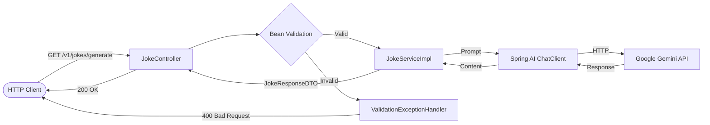

# Spring AI Jokes 🤖🃏

REST API that generates jokes using artificial intelligence (Google Gemini) through Spring AI.

## Overview

This is a Spring Boot application that exposes an endpoint for customizable joke generation. The user chooses the **theme**, the **humor level**, and the **word count**, and the AI generates a tailored joke.

### Tech Stack

- Java 21
- Spring Boot 3.5
- Spring AI 1.0.3 (OpenAI adapter pointing to Google Gemini)
- Bean Validation (Jakarta)
- SpringDoc OpenAPI (Swagger UI)
- Lombok
- JUnit 5 + Mockito

## Architecture



### Package Structure

```
src/main/java/br/com/gabrielga_dev/spring_ai_jokes/
├── config/
│   ├── ChatClientConfig.java      # ChatClient bean
│   └── OpenApiConfig.java         # Swagger configuration
├── controller/
│   ├── api/
│   │   └── JokeApi.java           # Interface with OpenAPI annotations
│   ├── handler/
│   │   └── ValidationExceptionHandler.java
│   └── JokeController.java
├── data_shape/
│   ├── dto/
│   │   ├── request/
│   │   │   └── JokeRequestDTO.java
│   │   └── response/
│   │       └── JokeResponseDTO.java
│   └── types/
│       ├── LevelType.java
│       └── ThemeType.java
└── service/
    ├── JokeService.java
    └── impl/
        └── JokeServiceImpl.java
```

## API

### `GET /v1/jokes/generate`

Generates a joke based on the provided parameters.

#### Parameters (query string)

| Parameter   | Type   | Required | Description                    | Accepted values                                                    |
|-------------|--------|----------|--------------------------------|--------------------------------------------------------------------|
| `theme`     | enum   | ✅       | Joke theme                     | `GEOGRAPHY`, `MATH`, `HISTORY`, `CHEMISTRY`, `SOFTWARE_DEVELOPMENT`, `BIOLOGY` |
| `level`     | enum   | ✅       | Humor level                    | `NO_FUN_AT_ALL`, `FUN`, `VERY_FUNNY`                              |
| `wordCount` | int    | ✅       | Desired word count             | Min: `5`, Max: `500`                                               |

#### Request example

```bash
curl "http://localhost:8080/v1/jokes/generate?theme=SOFTWARE_DEVELOPMENT&level=VERY_FUNNY&wordCount=50"
```

#### Success response (200)

```json
{
  "content": "Why do programmers prefer dark mode? Because light attracts bugs!"
}
```

#### Validation error response (400)

```json
{
  "theme": "Theme is required",
  "wordCount": "Word count must be at least 5"
}
```

#### Response when AI cannot generate a joke

```json
{
  "content": "Your joke request is boring!"
}
```

### Swagger UI

With the application running, access:

```
http://localhost:8080/swagger-ui/index.html
```

The OpenAPI specification is available at:

```
http://localhost:8080/v3/api-docs
```

## How to Run

### Prerequisites

- Java 21+
- Maven 3.9+ (or use the wrapper `./mvnw`)
- Google Gemini API key

### 1. Configure the API key

Set the `AI_API_KEY` environment variable with your Google Gemini API key:

```bash
export AI_API_KEY=your-api-key-here
```

### 2. Run the application

```bash
./mvnw spring-boot:run
```

The application will be available at `http://localhost:8080`.

### 3. Run the tests

```bash
./mvnw test
```

## Tests

The project has two types of tests:

- **Unit tests**: `JokeServiceImplTest` (business logic) and `JokeControllerTest` (isolated web layer with `@WebMvcTest`)
- **Integration test**: `JokeControllerIntegrationTest` (full Spring context with `@SpringBootTest` and mocked ChatClient)
